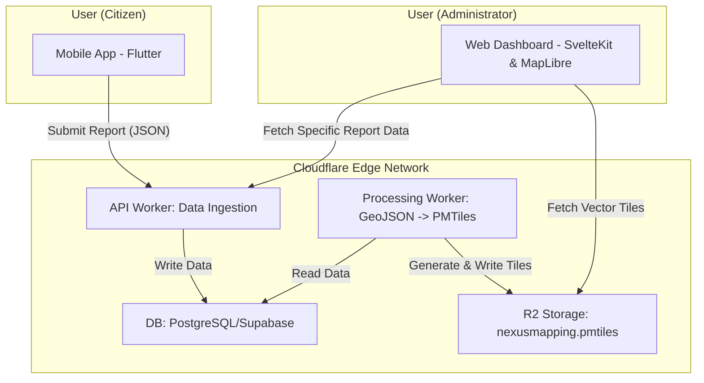

---

# NexusMapping: A Reference Architecture for High-Performance Civic Reporting

NexusMapping is a complete reference architecture that demonstrates a robust, scalable, and cost-effective solution for civic reporting and large-scale geographic data visualization.

This open-source project, developed by **PT AITI GLOBAL NEXUS**, is designed to serve as a blueprint for founders, CTOs, and development teams facing the challenge of building location-aware applications that need to handle thousands of data points without compromising on performance or user experience.

**[ [Live Demo Coming Soon] ]** &nbsp;&nbsp; **|** &nbsp;&nbsp; **[ [Read Our In-Depth Article] ]**

---

## 1. The Business Problem: When Standard Maps Fail

Many applications require users to report incidents, observations, or requests tied to a specific geographic location. For a small number of data points, a standard solution like embedding a Google Map and plotting markers is sufficient.

However, this approach breaks down quickly at scale. Imagine an application with 50,000+ reports. Attempting to render tens of thousands of individual markers on a map is not feasible:
*   **Performance Collapse:** The user's browser will slow to a crawl, leading to a frustrating and unusable experience.
*   **Prohibitive Costs:** API usage costs for fetching and rendering that many objects can become unexpectedly high.
*   **Lack of Insight:** A map cluttered with thousands of individual dots provides noise, not actionable insight.

This project provides a direct architectural solution to this common, yet complex, scaling problem.

## 2. Our Architectural Solution: A Modern, Three-Part System

NexusMapping solves this challenge by implementing a decoupled, modern architecture composed of three primary applications working in concert:

1.  **A Mobile App (`Flutter`)**: A cross-platform mobile application for citizens to submit reports from the field. It's designed for simplicity and offline-first capabilities.
2.  **A Serverless API (`Cloudflare Workers`)**: A highly scalable, globally distributed backend that ingests data, processes it, and serves it efficiently.
3.  **A Web Dashboard (`SvelteKit`)**: A sophisticated administrative and analytics dashboard for visualizing, filtering, and understanding the reported data in aggregate.

The key innovation lies in how the data is processed and served to the web dashboard, which we explain in the deep-dive below.

## 3. Technology Deep-Dive: The "Why" Behind Our Choices

Our technology stack was chosen to prioritize performance, developer experience, and long-term scalability.

#### **Frontend: The Right Tool for the Job**
*   **Why Flutter for the Mobile App?** Flutter allows us to build a single, high-quality codebase that compiles to native applications for both iOS and Android. This drastically reduces development time and ensures a consistent user experience.
*   **Why SvelteKit for the Web Dashboard?** For a data-heavy dashboard, performance is paramount. SvelteKit is a compiler that ships minimal, highly-optimized JavaScript, resulting in a faster, more responsive user interface—critical for analysts and administrators who use the app all day.

#### **Backend: Why Serverless on Cloudflare?**
*   **Unmatched Scalability & Performance:** Cloudflare Workers run on a global network, meaning our API logic is executed closer to the user, reducing latency. The platform scales automatically from zero to millions of requests without any server management.
*   **Cost-Effectiveness:** A traditional server sits idle, costing money. With a serverless model, we only pay for the exact resources we use, making it incredibly efficient for applications with variable traffic.

#### **The Core Data Challenge: Our Vector Tile Pipeline**
This is the heart of our solution to the map performance problem. Instead of sending thousands of raw data points to the browser, we pre-process them into **Vector Tiles**.

1.  **Data Ingestion:** Reports are submitted to our Cloudflare Worker.
2.  **Data Processing:** On a schedule or via a trigger, a worker process queries our database for all geographic points.
3.  **Tile Generation:** It uses a library to convert the GeoJSON data into the highly efficient `PMTiles` format—a single-file, planet-scale archive for vector tiles.
4.  **Serving Tiles:** This single `PMTiles` file is stored in a simple object storage bucket (like Cloudflare R2 or AWS S3).
5.  **Client-Side Rendering:** Our SvelteKit web dashboard uses a library like **MapLibre GL JS** to intelligently request and render only the tiles visible in the user's current map view.

This approach means the browser only ever has to handle a few small, efficient vector tile files at a time, allowing us to visualize millions of data points with buttery-smooth performance.

## 4. System Architecture Diagram

This diagram illustrates the flow of information within the NexusMapping architecture.



## 5. Getting Started

This repository is a monorepo containing all three applications. To get started:

1.  **Clone the repository:**
    ```bash
    git clone https://github.com/BuildTheNexus/nexusmapping.git
    cd nexusmapping
    ```

2.  **Install dependencies:**
    *(Instructions for installing dependencies for each app will be added here)*

3.  **Configure environment variables:**
    *(Each app will have a `.env.example` file. Copy it to `.env` and fill in the required values.)*

4.  **Run the development servers:**
    *(Instructions for running each app will be added here)*

## 6. About Us

We are **PT AITI GLOBAL NEXUS**, a "Human+AI" product development agency. We partner with founders and organizations to build high-quality software by combining expert human oversight with advanced AI-driven development.

This reference architecture is a reflection of our philosophy: build thoughtfully, use the right tools for the job, and solve real-world business problems with elegant and efficient technical solutions.

---
### Need help with a similar architectural challenge?

If your team is tackling complex application development and you value a pragmatic, architecture-first approach, we'd love to talk.

**[Book a Discovery Call with Us]**