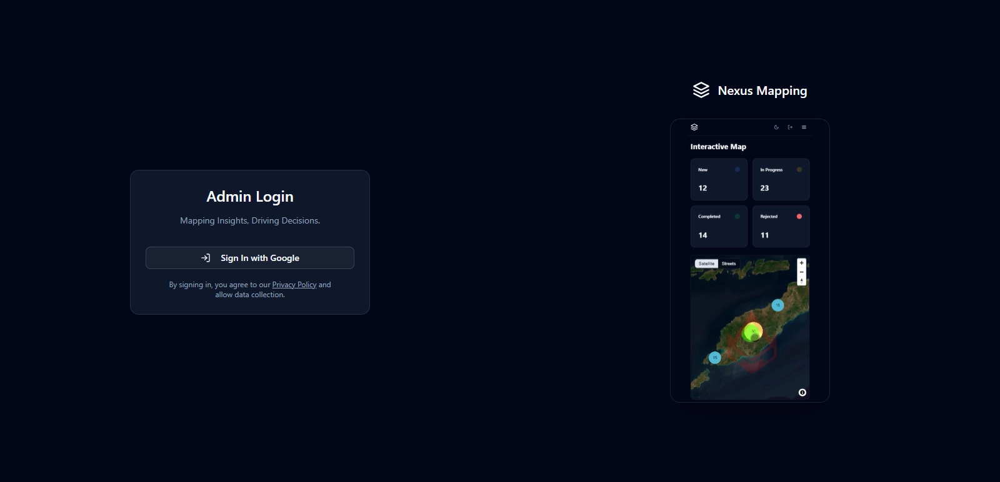
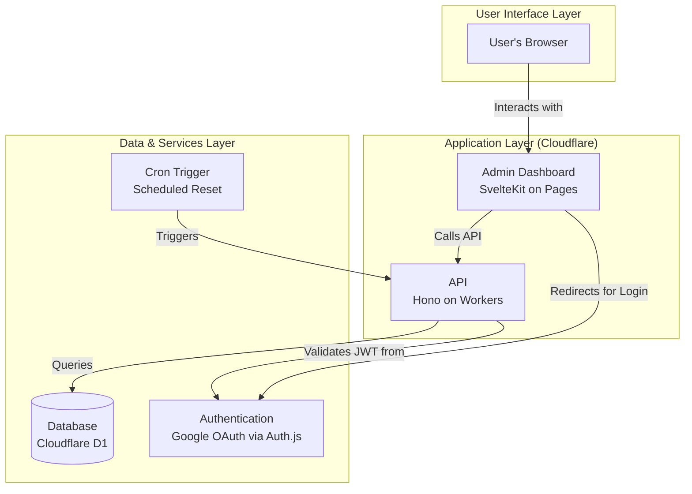

# Nexus Mapping: A Full-Stack, Production-Grade Mapping & Data Management Platform

[](https://github.com/BuildTheNexus/NexusMapping)
[](./license)
[](https://www.cloudflare.com/)
[](https://kit.svelte.dev/)
[](https://hono.dev/)

 

---

### **Build The Nexus**

**Nexus Mapping** is more than just an application; it is a reference architecture for building modern, secure, and scalable full-stack solutions. It serves as a live demonstration of a professional, decoupled monorepo leveraging a bleeding-edge, serverless-first technology stack.

The platform provides a complete administrative dashboard for visualizing, managing, and analyzing geographic data points, architected as a "Public Sandbox" that automatically resets hourly for an interactive and risk-free user experience.

[](https://mapping.aitiglobal.link)

---

## 🎯 Core Features

*   **✨ Exceptional Login Experience:** A premium, responsive, and performant showcase login page featuring a lazy-loaded video asset and a sophisticated, monochromatic UI.
*   **🔐 Secure, Role-Based Access:** A full-stack RBAC system built from the ground up, with a flexible architecture that has been evolved into a self-healing public demo.
*   **🗺️ Fully Interactive Map:** A high-performance map UI using MapLibre GL, featuring data-driven styling, intelligent point clustering, and interactive popups.
*   **📊 Comprehensive Data Management:** A complete interface for viewing and updating data, with server-side search, filtering, and pagination.
*   **🤖 Self-Healing Sandbox:** The entire platform is designed as a public demo that automatically and reliably resets its database every hour using a Cloudflare Cron Trigger.
*   **🛡️ Hardened API:** The backend API is protected against abuse with application-level rate limiting and secure, role-based endpoints.

---

## 🏛️ Architecture & Technology

Our development philosophy is **decoupled, serverless-first, and type-safe.** The project is built as a `pnpm` monorepo, ensuring a clean separation of concerns between the frontend and backend while maintaining a unified development experience.

### Architectural Diagram



### Technology Stack

| Category           | Technology                                                                                           |
| ------------------ | ---------------------------------------------------------------------------------------------------- |
| **Monorepo**       | `pnpm Workspaces`                                                                                    |
| **Frontend**       | SvelteKit (Svelte 5), TypeScript, Tailwind CSS v4, `shadcn-svelte`, MapLibre GL JS                       |
| **Backend API**    | Hono on Cloudflare Workers                                                                           |
| **Database**       | Cloudflare D1 (SQL), `wrangler` for migrations                                                         |
| **Authentication** | `Auth.js` / `SvelteKitAuth` with Google Provider                                                       |
| **Automation**     | Cloudflare Cron Triggers for scheduled tasks                                                         |
| **Tooling**        | Vite, ESLint, Prettier                                                                               |

---

## 🚀 Getting Started (Local Development)

### Prerequisites

*   Node.js (v18 or higher)
*   `pnpm` package manager (`npm install -g pnpm`)
*   Git

### 1. Clone the Repository

```bash
git clone https://github.com/BuildTheNexus/NexusMapping.git
cd NexusMapping
```

### 2. Install Dependencies

```bash
pnpm install
```

### 3. Configure Environment Variables

You will need to create two `.dev.vars` files for the local development servers.

**For the Worker (`apps/nexusmapping-worker/.dev.vars`):**
```
# Get these from your Google Cloud Platform console
GOOGLE_CLIENT_ID="YOUR_GOOGLE_CLIENT_ID"
GOOGLE_CLIENT_SECRET="YOUR_GOOGLE_CLIENT_SECRET"
ADMIN_APP_GOOGLE_CLIENT_ID="YOUR_GOOGLE_CLIENT_ID" # Often the same as above

# Generate a long, random string: openssl rand -base64 32
AUTH_SECRET="YOUR_AUTH_SECRET"

# For the Public Sandbox, this can be left empty or contain your primary admin email
ADMIN_EMAILS="your-email@gmail.com"

# A long, random string to protect the reset endpoint
DB_RESET_SECRET="a-very-long-and-random-string-for-security"
```

**For the Admin App (`apps/nexusmapping-admin/.env`):**
```
# Your API key from maptiler.com
VITE_MAPTILER_API_KEY="YOUR_MAPTILER_API_KEY"
```

### 4. Set Up and Seed the Database

These commands are run from the `apps/nexusmapping-worker` directory.

```bash
cd apps/nexusmapping-worker

# Create the local database file
pnpm wrangler d1 migrations apply nexusmapping-db --local

# Seed the database with initial data
pnpm wrangler d1 execute nexusmapping-db --local --command="DELETE FROM map_points"
pnpm exec wrangler d1 execute nexusmapping-db --local --command="DELETE FROM users"
pnpm exec wrangler d1 execute nexusmapping-db --local --file=./migrations/seed.sql # (Note: You may need to create this seed file)
```
*Self-correction: A `seed.sql` is more robust. For now, the user-driven seeder is sufficient for local dev.*

### 5. Run the Development Server

Run this command from the **project root**.

```bash
pnpm dev
```
*   The Admin Dashboard will be available at `http://localhost:5173`.
*   The Worker API will be available at `http://localhost:8788`.

---

## 🔑 Key Learnings & Architectural Decisions

This project served as a testbed for several key architectural patterns:

1.  **The "Ephemeral Admin" / Public Sandbox Model:** Instead of a restrictive `viewer` role, we chose to grant all public users temporary admin privileges. This is combined with a self-healing, hourly database reset via a Cloudflare Cron Trigger, providing a fully interactive and risk-free demo experience.
2.  **The Showcase Login Page:** We intentionally evolved the login page from a simple form into a premium, two-panel showcase. This included solving complex CSS layout challenges (`h-screen` vs `min-h-screen`) and implementing a performant, lazy-loading video (`onMount` with `data-src`) to create a powerful first impression without sacrificing page speed.
3.  **Full-Stack, Type-Safe RBAC:** We built a complete Role-Based Access Control system from the ground up, demonstrating a deep understanding of security from database schema design to frontend session management and secure API middleware.
4.  **Dependency-Free, Runtime-Aware Middleware:** After an external library (`hono-rate-limiter`) proved incompatible with the Cloudflare Worker's runtime, we engineered a dependency-free, in-memory rate-limiter from scratch that respects the runtime's constraints.

---

Built by **PT AiTi Global Nexus**.
